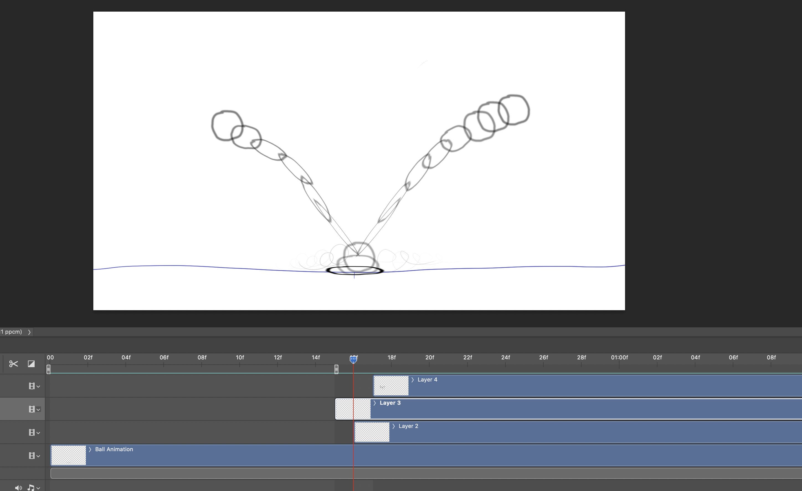

## <a href="../index">Return to index</a>

# Squash & Stretch + Exaggeration Excercise

### In this excercise I animated a ball falling, hitting the ground and bouncing up again.
### Squash & Stretch is used when the ball moves closer to the ground and hits the ground.
### The squash & stretch of the ball is also exaggerated so it seems more stretched than it actually is for effect.
### There is also a secondary action in this animation where the ball collides with the ground a cloud of dust is created to show the impact.