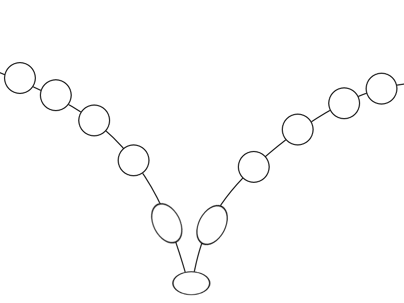

## <a href="../index">Return to index</a>

## <a href="principles">Return to principles list</a>

# 01 - Squash & Stretch

### Squashing an stretching an object will show how an object would behave when it preforms a certain action.
### A water ballon would have a lot of stretching when it collides with the ground.
### A tennis ball on the other hand would not stretch as much.

## Image example:
