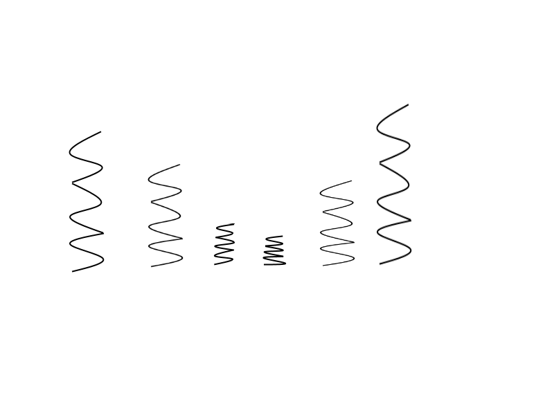

## <a href="../index">Return to index</a>

## <a href="p01">Return to principles list</a>

# 02 - Anticipation

### The animation that prepares for the main action
### A spring would squish down before it pops back up gives the effect of anticipation.

## Image example:
