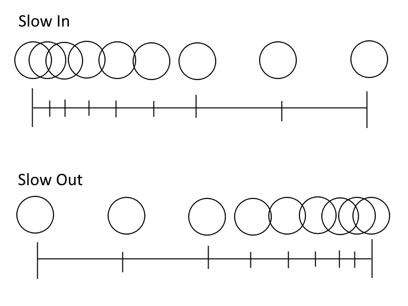

## <a href="../index">Return to index</a>

## <a href="principles">Return to principles list</a>

# 06 - Slow in Slow out

### When an object starts moving or ends moving it would not come to a complete stop immediately.
### It would gradually increase in speed when starting.
### And would gradually slow down when stopping.
### A ball would not start at top speed when it begins falling it would build up speed over time.

## Image example:

## Use in animation
### I used this when the characters swing their swords the sword moves a bit slower when it starts to move and when it reaches it highest point.
### The speed of the characters swinging thier sword down is faster than lifting it up.
