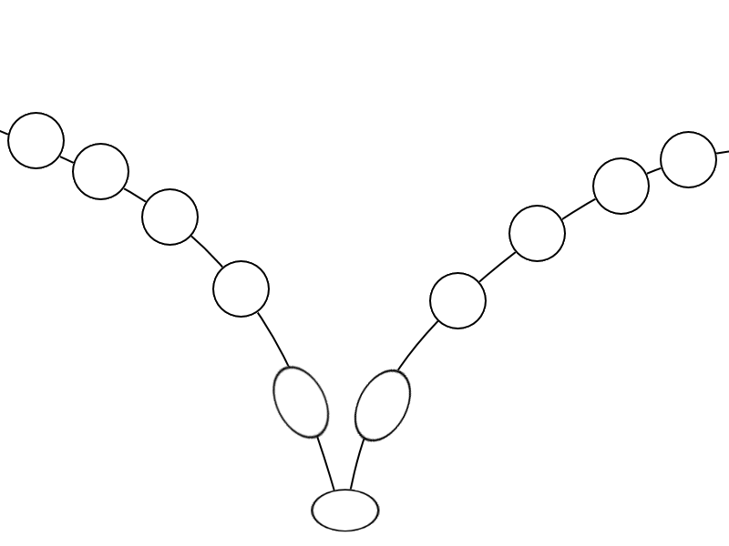

## <a href="../index">Return to index</a>

## <a href="principles">Return to principles list</a>

# 07 - Arcs

### A ball would not fall directly downwards when thrown.
### It would gain speed over time resulting in it falling in the shape of an arc. 

## Image example:
