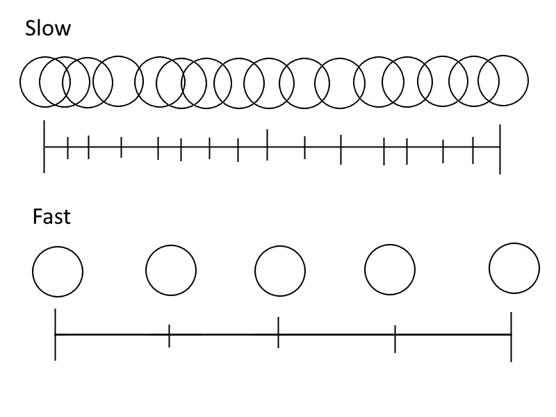

## <a href="../index">Return to index</a>

## <a href="principles">Return to principles list</a>

# 09 - Timing

### Timing reflects how fast an object is going to move over time.
### The closer the next frame is to the previous frame would result in slow motion. 
### Having a larger gap between frames would make it faster.

## Image example:

## Use in animation
### I used this for the characters walking, so they did not appear to be walking too fast.