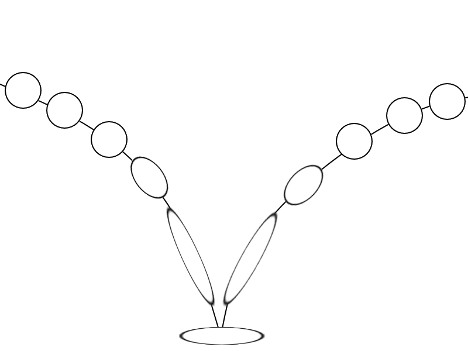

## <a href="../index">Return to index</a>

## <a href="principles">Return to principles list</a>

# 10 - Exaggeration

### Exaggeration is giving an animation an over effect giving more impact to the actions.
### A ball that is falling would not stretch extremely much but by giving it some exaggeration it can make the ball seem more intense.
### 

## Image example:
